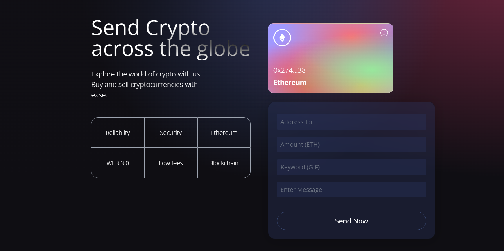
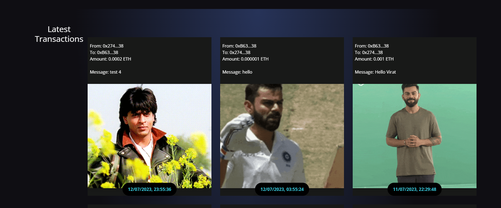

# sifKrypt

# Web3 Ethereum Transaction Website

Welcome to the Web3 Ethereum Transaction website hosted at [sifkrypt.netlify.app](https://sifkrypt.netlify.app/). This website allows you to make basic Ethereum transactions using a user-friendly interface. Simply connect your MetaMask account to view the latest transactions and interact with the Ethereum network.

## Technologies Used

- Frontend: React
- Smart Contract: Solidity
- Ethereum Network: Goerli

## Features

- Connect your MetaMask account to the website.
- Make Ethereum transactions with ease.
- Specify the recipient address, amount of ETH, keyword, and message.
- View a beautiful representation of all transactions with attached GIFs corresponding to keywords.

## Getting Started

To get started with the Web3 Ethereum Transaction website, follow these steps:

1. Clone the repository: `https://github.com/irfanfaraaz/sifKrypt.git`.
2. Install the necessary dependencies: `npm install`.
3. Start the development server: `npm start`.
4. Open your web browser and visit `http://localhost:5173`.

## Usage

1. Connect your MetaMask account by clicking on the "Connect" button.
2. Fill in the required transaction details:
   - Recipient Address: Enter the Ethereum address of the recipient.
   - Amount of ETH: Specify the amount of ETH to be sent.
   - Keyword: Provide a keyword for the transaction.
   - Message: Add an optional message related to the transaction.
3. Click the "Send Transaction" button to initiate the Ethereum transaction.
4. Once the transaction is completed, you will be redirected to the transaction history page.
5. Browse through the transaction history to view all previous transactions along with associated GIFs based on the keywords.

## Screenshots

_Figure 1: Homepage of the Web3 Ethereum Transaction website_

_Figure 2: Transaction history page with beautiful representation and attached GIFs_

## Contributing

Contributions are welcome! If you have any ideas or improvements, feel free to open an issue or submit a pull request. Please follow the [contribution guidelines](CONTRIBUTING.md) when contributing to this project.

---

For more information, please visit our website [sifkrypt.netlify.app](https://sifkrypt.netlify.app/) and start making secure and efficient Ethereum transactions using our user-friendly interface.

